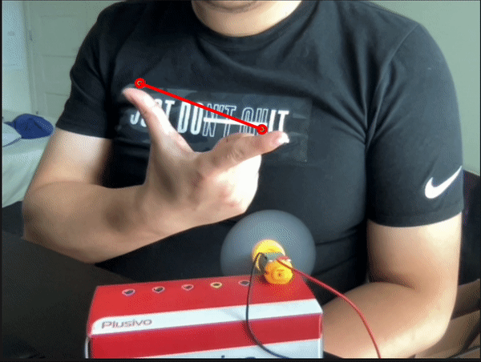

# Handpose Motor Control

I am interested in hand pose and want to expore more into it. So I had this idea to control a motor using handpose. 

# Hardware
* 3-6V motor
* 1N4001 diode
* Transistor
* 200 resisitor

I learned this set up from last year's pcom class. 
[Lab: Using a Transistor to Control a High Current Load](https://itp.nyu.edu/physcomp/labs/motors-and-transistors/using-a-transistor-to-control-a-high-current-load/)

# ML and Arduino 

Arduino code is pretty simple. Since for motors we can use analog output, speed of motor will have range from 0 to 255. Simply read serial input and write to output pin.

For handpose, I used the index fingertip and thumb tip's distance as the controllor. Calculating the distance and mapping it from 0 to 255 will do.  Handpose is not stable sometimes which could cause some error. 

[p5 sketch](https://editor.p5js.org/yzhang33/sketches/EW2-mAia9)

[video](https://youtu.be/TPOsOZvmayo)