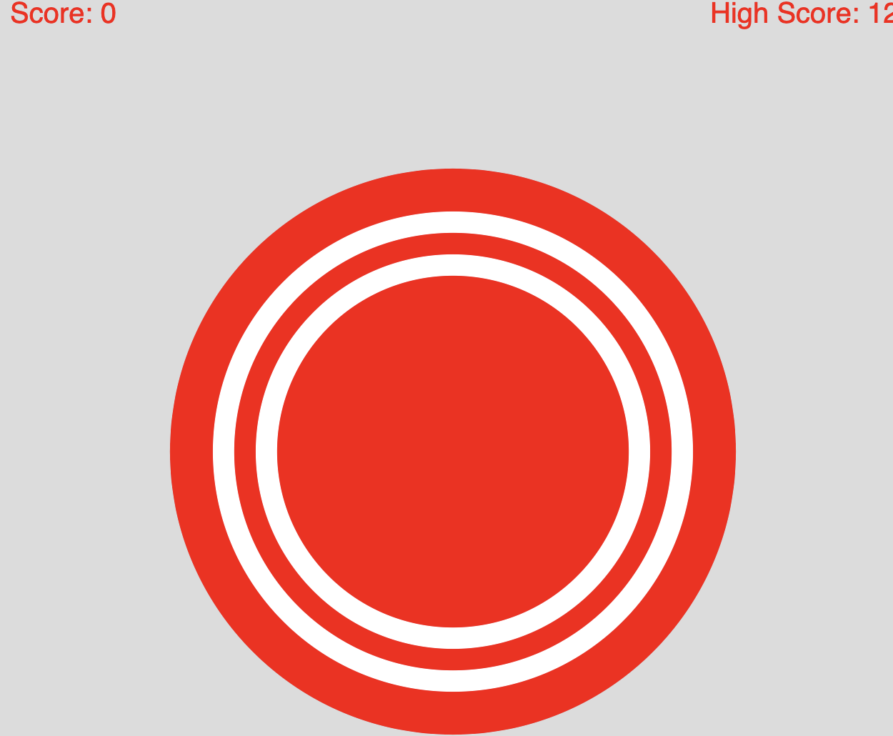

# The Punch Game
## Proposal 
I changed my Final idea to build a punch game instead of train my magic wand gesture. Since training my gesture is kind of complicated and I do not think I can finish it in one week. So I decided to incorporate emoji to gesture and take it further. 

## Training Punch and Flex on Arduino

Colleting the IMU data from arduino and train the data on a nerual network in [google colab](https://colab.research.google.com/github/arduino/ArduinoTensorFlowLiteTutorials/blob/master/GestureToEmoji/arduino_tinyml_workshop.ipynb). Using the model exported from google colab as the machine learning model for Tensorflow Lite. 

## Build a Punch Game

I really love the ring fit game created by Nintendo. Espically during coivd, it keeps me fit. So I want to build a game to keep me active while I am at my desk. By running the gesture model, arduino can detect punch and flex. So I created a target for players to punch but the target shinks over time. Player must do the flex to make it larger in order to keep playing. One punch will get one point. The game objective is to get as much points as possible. 

[p5 sketch](https://editor.p5js.org/yzhang33/sketches/M2aC7t_Lv)